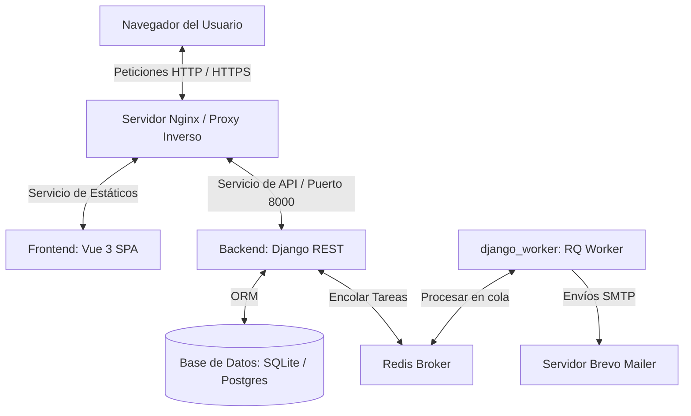
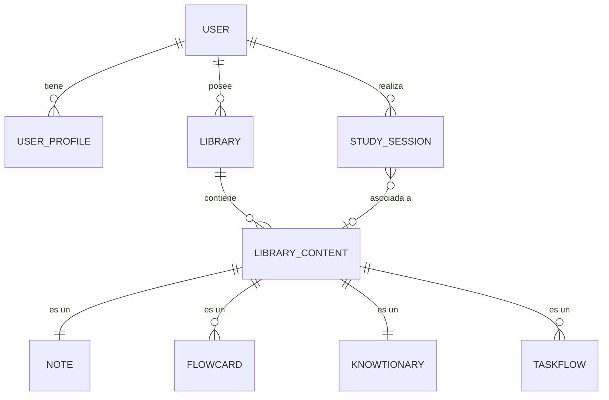

# Diagramas y Prototipado del Sistema

En esta sección se detalla el diseño arquitectónico y de datos de **KnowFlow**, sirviendo como plano estructural del proyecto.

---

## 1. Diagrama de Arquitectura de la Aplicación

KnowFlow sigue un patrón clásico de **Arquitectura en Tres Capas (Three-Tier Architecture)**, completamente contenerizada en Docker para producción:

---

## 2. Diagrama de Base de Datos (Modelo Entidad-Relación)

Para estructurar la información del usuario de forma eficiente sin redundancias, el modelo de datos de Django organiza todos los recursos de aprendizaje mediante una tabla puente llamada **LibraryContent** (Contenido de Librería), facilitando búsquedas globales y favoritos:

### Explicación del Modelo Relacional:
*   **`User` & `UserProfile`**: Almacena las credenciales y los datos extendidos del perfil (avatar, racha de estudio, plan de suscripción).
*   **`Library`**: La carpeta madre (ej. "Asignatura"). Cada librería pertenece a un único usuario.
*   **`LibraryContent`**: Tabla puente. Cada recurso creado (nota, tarjeta, cuestionario, tarea) se registra aquí primero. Almacena metadatos comunes como si es **favorito**, si es **público**, el título del recurso y la fecha de creación.
*   **Recursos Específicos (`Note`, `Flowcard`, etc.)**: Tablas hijas enlazadas con una relación de uno a uno (`OneToOneField`) o clave foránea con la tabla puente. Esto permite borrar en cascada de forma segura e implementar búsquedas globales de manera ágil.

---

## 3. Fase de Prototipado y Diseño de Interfaz (Wireframes)

Durante la fase inicial del proyecto, se definieron las interfaces basándose en las mejores prácticas de experiencia de usuario (UX):
1.  **Enfoque Mobile-First**: Garantizar que el temporizador Pomodoro y el repaso de tarjetas sea cómodo en pantallas pequeñas.
2.  **Modo Oscuro Integrado**: Crucial para estudiantes que repasan de noche, reduciendo la fatiga visual.
3.  **Acceso a la Acción**: La barra de navegación lateral fija en pantallas de escritorio permite cambiar entre el temporizador y tus apuntes en un solo clic, sin perder tu progreso de estudio actual.
