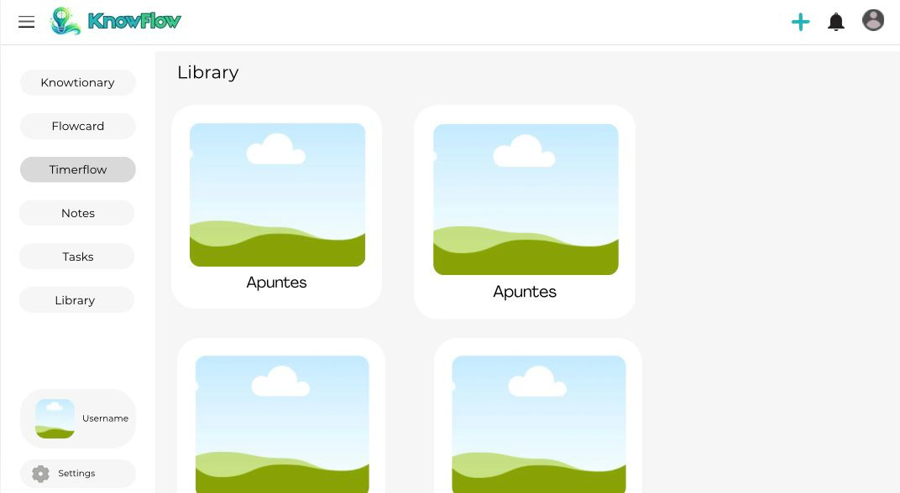
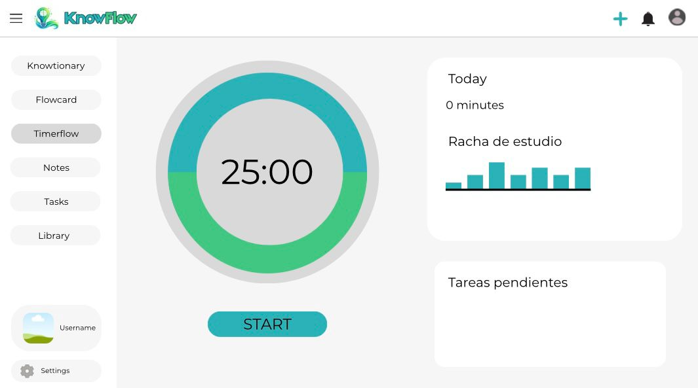

# Prototipado y Diseño de Interfaz

En esta sección se muestran los primeros diseños e ideas visuales que sirvieron como punto de partida para el desarrollo de la interfaz de usuario de **KnowFlow**.

---

## 1. Bocetos y Concepto Inicial del Proyecto

Durante las primeras fases de planificación, realizamos wireframes para plasmar la estética, distribución y estructura de pantallas que queríamos para la aplicación. El objetivo principal era visualizar de qué manera se organizarían los diferentes paneles de estudio y las librerías dentro del espacio de trabajo del alumno.

A continuación se muestran los dos bocetos iniciales que definieron el concepto original de la plataforma:

### Primer Boceto: Vista de Organización y Carpetas
En este primer prototipo conceptual, diseñamos la distribución del menú lateral y la pantalla de visualización de contenidos y carpetas de estudio, buscando una interfaz compacta.

### Segundo Boceto: Detalle de Herramientas de Estudio y Flujo

---

## 2. Evolución del Diseño con el Tiempo

El diseño original propuesto en estas imágenes ha ido cambiando y evolucionando de manera notable a lo largo de los meses de desarrollo del proyecto:

*   **Simplificación y Limpieza Visual**: La estética original que teníamos en mente presentaba una interfaz algo más simple. Durante la programación de la web, optamos por simplificar los bordes, ampliar el espaciado y utilizar tipografías más legibles.

*   **Adaptación al Modo Oscuro**: El diseño final ha incorporado una paleta de colores sofisticada con soporte completo para Modo Claro y Modo Oscuro, algo que no estaba tan detallado en las primeras maquetas en papel y digital.
*   **Evolución del Menú y del Dashboard**: La barra de navegación lateral y el panel de estadísticas diarias se rediseñaron para ser completamente dinámicos y responsivos, adaptándose automáticamente a pantallas de móviles y tablets, algo que requirió refactorizar la estructura de rejilla (grid) planteada originalmente.

En conclusión, aunque los bocetos originales sirvieron como una guía indispensable para arrancar y estructurar los módulos de la aplicación, el resultado final en producción de KnowFlow es una versión mucho más madura, limpia, moderna y cómoda para el usuario.
