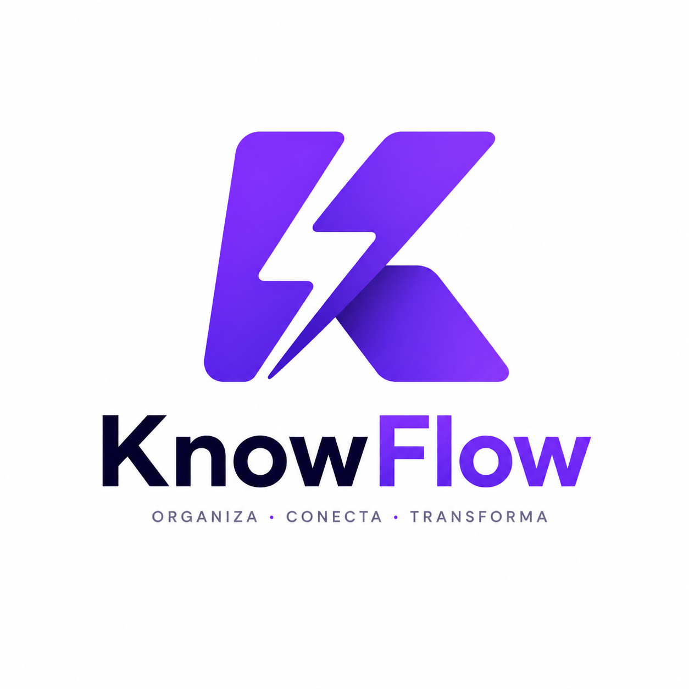

# Guía Rápida de Markdown en KnowFlow

**Markdown** es un lenguaje de marcado ligero muy utilizado para dar formato a textos de manera rápida y sencilla. En **KnowFlow**, el módulo de **Notes (Apuntes)** es completamente compatible con Markdown, lo que te permite estructurar tus temas de estudio, añadir negritas, crear tablas y resaltar código sin levantar las manos del teclado.

A continuación, tienes una guía rápida de 5 minutos con la sintaxis más utilizada.

---

## 1. Encabezados (Títulos)
Utiliza el símbolo `#` al inicio de una línea para crear títulos. Cuantos más `#` uses, más pequeño será el título.
```markdown
# Título Principal (H1)
## Sección Principal (H2)
### Subsección (H3)
#### Título de Cuarto Nivel (H4)
```

---

## 2. Formato de Texto
Puedes dar énfasis a tus palabras de forma rápida:
```markdown
**Texto en Negrita**
*Texto en Cursiva*
***Negrita y Cursiva a la vez***
~~Texto Tachado~~
`código en línea` (para resaltar palabras sueltas)
```

---

## 3. Listas
Perfectas para resumir características, conceptos o crear cuestionarios propios:

### Listas Desordenadas:
```markdown
- Primer elemento
- Segundo elemento
  - Sub-elemento sangrado (usa tabulador)
```

### Listas Ordenadas:
```markdown
1. Primer paso
2. Segundo paso
3. Tercer paso
```

---

## 4. Enlaces e Imágenes
Añade recursos externos o capturas de pantalla a tus apuntes:
```markdown
[Visitar Google](https://google.com)

```

---

## 5. Bloques de Cita
Ideal para destacar definiciones importantes, frases de autores o conceptos clave del temario:
```markdown
> "La educación no es la preparación para la vida; la educación es la vida misma." - John Dewey.
```

---

## 6. Bloques de Código
Si estudias informática, matemáticas o ingeniería, puedes formatear trozos de código con resaltado de sintaxis usando tres acentos graves (```):

````markdown
```javascript
function saludar() {
  console.log("¡Hola, estudiante de KnowFlow!");
}
```
````

---

## 7. Tablas
Excelente para comparar conceptos o resumir datos:
```markdown
| Asignatura | Tareas Pendientes | Horas de Pomodoro |
| :--- | :---: | :---: |
| Matemáticas | 2 | 4 horas |
| Biología | 1 | 6 horas |
| Programación | 0 | 12 horas |
```

---

## 8. Listas de Tareas
Sintaxis para listas de verificación interactivas:
```markdown
- [x] Repasar tema 1 de Historia
- [ ] Hacer quiz de vocabulario en inglés
- [ ] Estudiar 2 ciclos Pomodoro de Física
```

---
*¡Usa esta guía como referencia rápida para enriquecer visualmente todos tus apuntes en las notas de KnowFlow!*